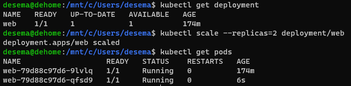
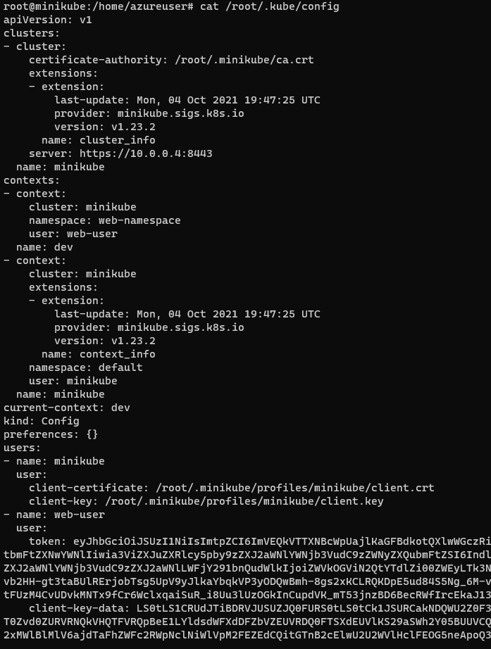
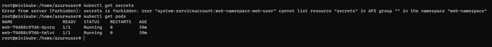
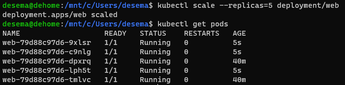

# Задание 1: Запуск пода из образа в деплойменте
В текущем контексте сделал деплоймент и 2 реплики, проверил наличие подов.


# Задание 2: Просмотр логов для разработки
Создал нового сервис-юзера web-user и неймспейс web-namespace. 
```yaml
apiVersion: v1
kind: ServiceAccount
metadata:
  name: web-user
  namespace: web-namespace
```
<br>
Ему сделал отдельную роль logs с правами на просмотр:

```yaml
kind: Role
apiVersion: rbac.authorization.k8s.io/v1
metadata:
  name: logs
  namespace: web-namespace
rules:
- apiGroups: [""]
  resources: ["pods"]
  verbs: ["get", "list", "watch", "logs", "describe", "get"]
```
<br>

После этого сделал маппинг роли и юзера:
```yaml
kind: RoleBinding
apiVersion: rbac.authorization.k8s.io/v1
metadata:
  name: web-user-logs
  namespace: web-namespace
subjects:
- kind: ServiceAccount
  name: web-user
  namespace: web-namespace
roleRef:
  apiGroup: rbac.authorization.k8s.io
  kind: Role
  name: logs
```
Далее посмотрeл токен юзера и вписал всё это дело в конфиг:


В результате получил работающее ограничение:


# Задание 3: Изменение количества реплик
Отмасштабировал деплоймент и убедился что все поды ожили:
<br>



